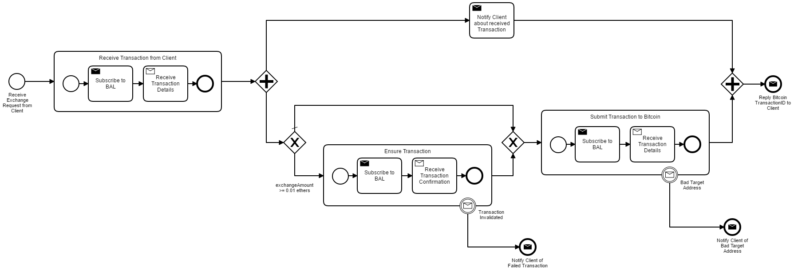

# BlockME Use-Case
This project represents a Camunda BPMN 2.0-based business process that can communicate with the 
[Blockchain Access Layer](https://github.com/ghareeb-falazi/BlockchainAccessLayer).

The model presented here is a conversion of the following Blockchain-aware model that uses the BlockME extension:


## BPMN 2.0-Compliant Model
The transformed BPMN 2.0 model (in xml format) can be found [here](src/main/resources/crypto-exchange.bpmn)
The model can be visualized and edited using [bpmn.io](https://demo.bpmn.io/), or [Camunda Modeler](https://camunda.com/download/).

A visualizatuin of the transformed BPMN 2.0-compliant model is presented below:



Some elements in the model have attached expressions (not shown in the figure), that allow setting and getting the values
of process variables which allow tasks, events and gates to share data (data flow).
Furthermore, message-sending tasks and events have associated Java classes that implement their logic.
Finally, messages are delivered to message-receiving tasks and events through the Camunda Enigne REST API.

## Configuraring the Process
A configuration file is used to specify the following values:
* The endpoint URL of the Camunda Engine REST API
* The URL of the Blockchain Access Layer RESTful API
* The source blockchain network-id
* The target blockchain network-id
* The exchange rate used

This file can be found [here](src/main/resources/config.properties)
## Building the Camunda Project
The project uses Java 8 and can be built and packaged using Maven. Please use the following command:
```
mvn install
```
The project is packaged into a WAR file which can be found in the folloing path:
```
target/crypto-exchange-1.0-SNAPSHOT.war
```
This WAR file contains the process model as well as the used java classes and their dependencies.
## Deploying the Process Model
1. Build and package the project into a WAR file (see above).
2. Install the standalone [Camunda Community Platform](https://camunda.com/download/) (follow the instructions in the website).
We call the path where you unzipped the distribution _$CAMUNDA_HOME$_
3. Camunda has an embedded Apache Tomcat server. Deploy the project you built in step 1 to this server by copying the WAR file
to the following folder:
```
$CAMUNDA_HOME$\server\apache-tomcat-XXX\webapps
```
You can now see the business process model in the various Camunda applications (Admin, Tasklist, and Cockpit): 
go to [the Welcome application](http://localhost:8080/camunda/) and use "demo/demo" as a username and password. Other users include "john/john".
## Initiating the Process
Using the [Tasklist](http://localhost:8080/camunda/app/tasklist/default/#/login) Camunda application, initiate the process 
by logging in (demo/demo) and then clicking on the button "Start process" and finally choosing "Crypto-Exchange".